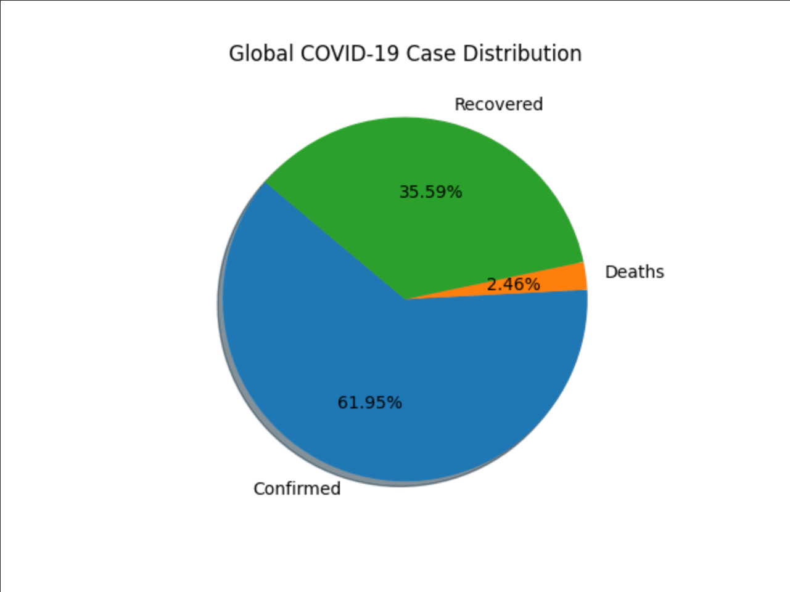
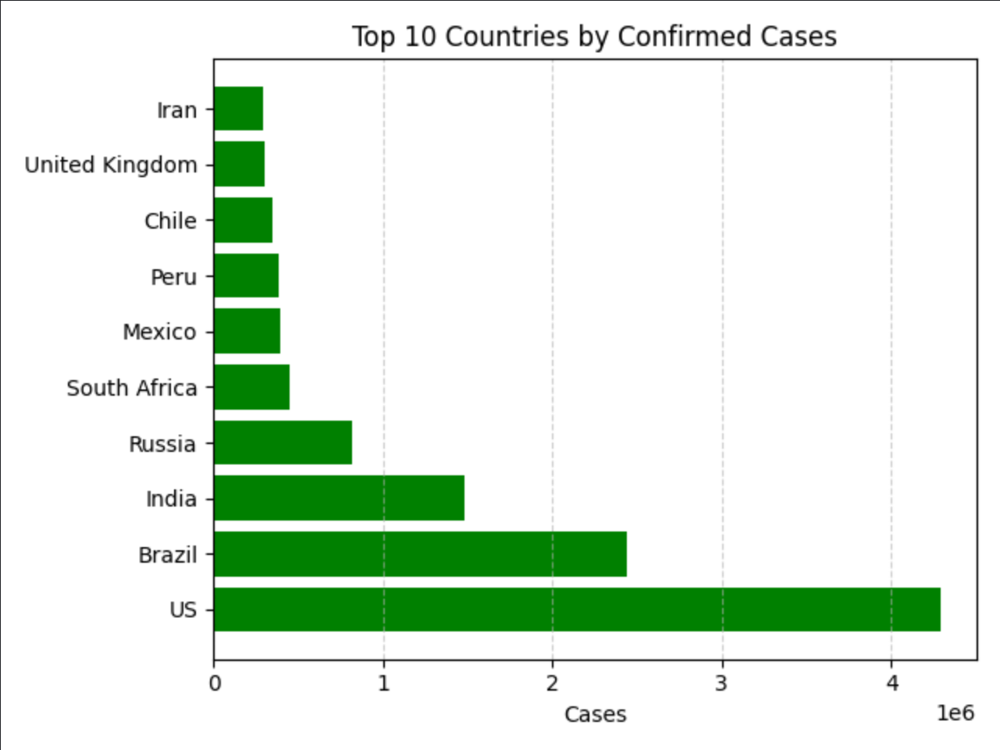
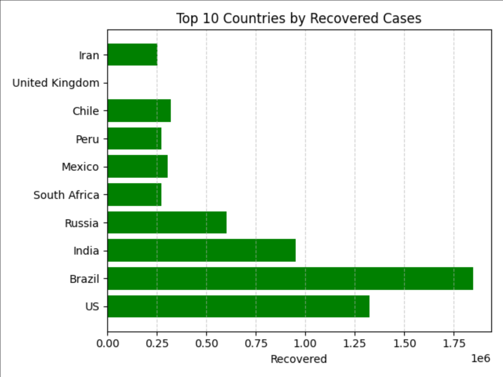
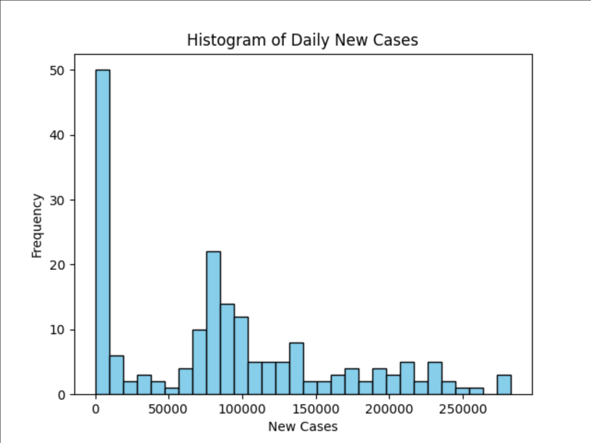
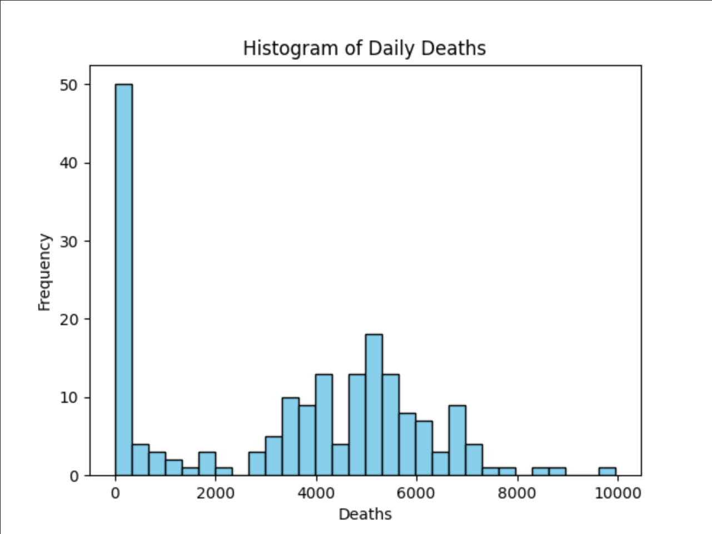
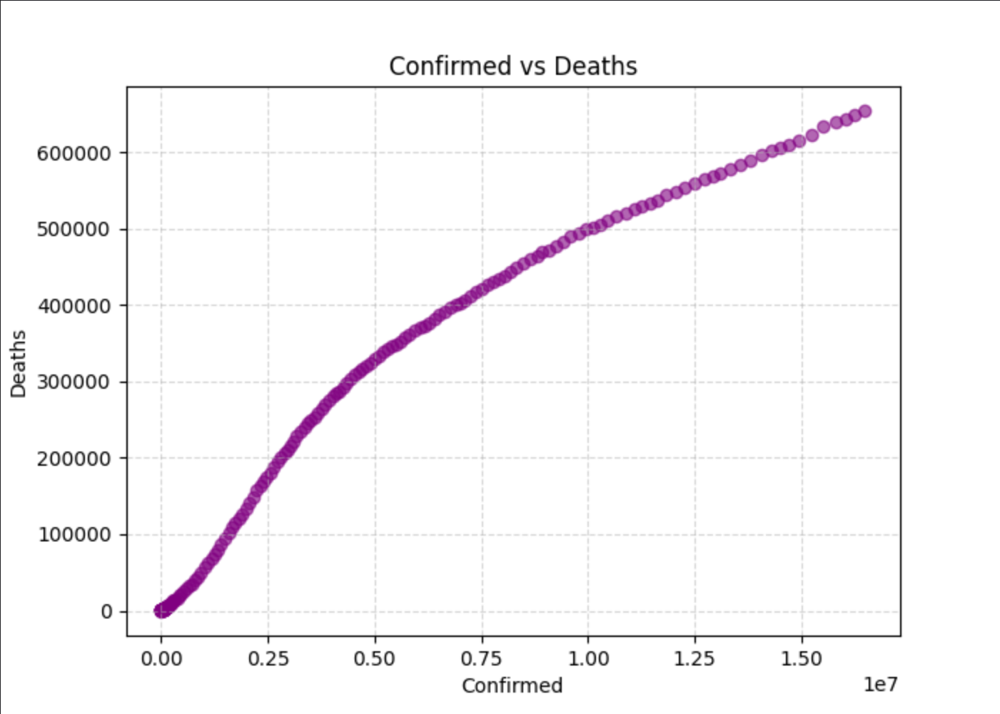
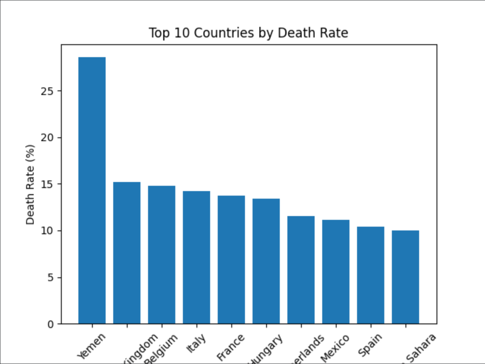
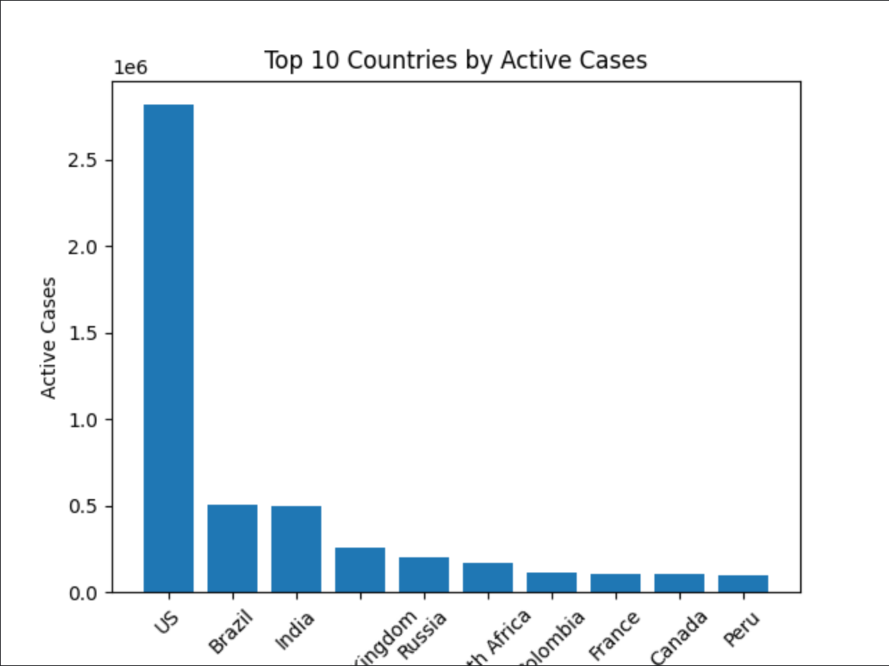

# 🦠 COVID-19 Data Analysis & Visualization Project

📊 An advanced data analytics project using **Python**, **NumPy**, **Pandas**, and **Matplotlib**  
to analyze and visualize the global impact of COVID-19.

---

## ✨ Project Highlights

✅ 10+ Advanced Visualizations  
✅ NumPy & Pandas logic  
✅ Real-world COVID-19 datasets  
✅ Clean, academic-level analysis  
✅ Suitable for college submission  

---

## 📂 Dataset Information

The following datasets are used:

- `day_wise.csv` – Daily global statistics  
- `country_wise_latest.csv` – Latest country-wise data  
- `covid_19_clean_complete.csv` – Cleaned historical data  

---

## 🧰 Technologies Used

- 🐍 Python  
- 🔢 NumPy  
- 🧾 Pandas  
- 📈 Matplotlib  

---

## 📊 Visualizations Output

### 🥧 1. Global COVID-19 Case Distribution (Advanced Pie Chart)


---

### 📊 2. Top 10 Countries by Confirmed Cases


---

### 📊 3. Top 10 Countries by Deaths


---

### 📊 4. Top 10 Countries by Recovered Cases


---

### 📉 5. Histogram of Daily New Cases


---

### 📉 6. Histogram of Daily Deaths


---

### 🔍 7. Scatter Plot: Confirmed vs Deaths


---

### 📊 8. Statistical Summary of Confirmed Cases


---

### 📊 9. Top 10 Countries by Death Rate


---

### 📊 10. Top 10 Countries by Active Cases


---

## 🧠 Concepts Covered

### 🔢 NumPy
- Arrays
- Mean, Max, Standard Deviation
- Numerical analysis

### 🧾 Pandas
- DataFrames
- GroupBy & aggregation
- Sorting & filtering
- Column operations
- Missing value analysis

### 📈 Visualization
- Comparative analysis
- Distribution analysis
- Relationship analysis

---

## ▶️ How to Run the Project

```bash
pip install numpy pandas matplotlib
python covid_analysis.py
