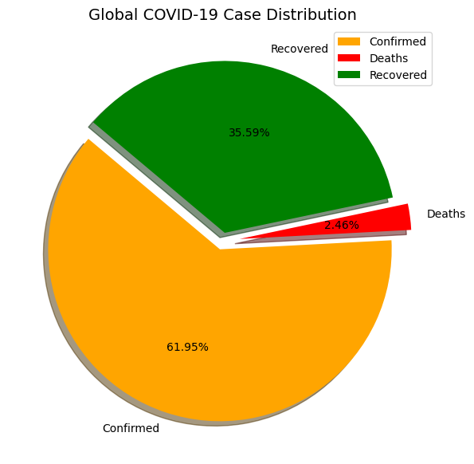
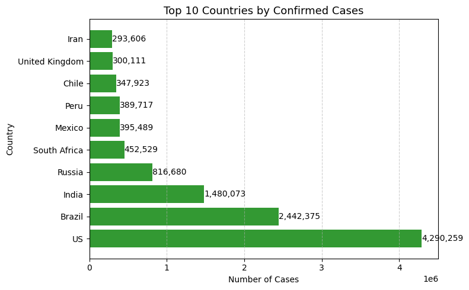
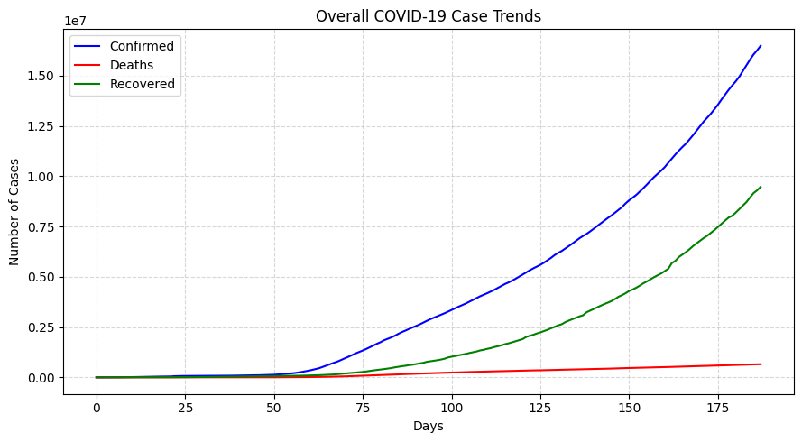
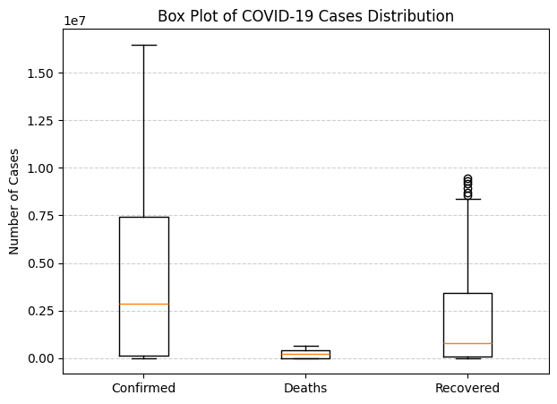
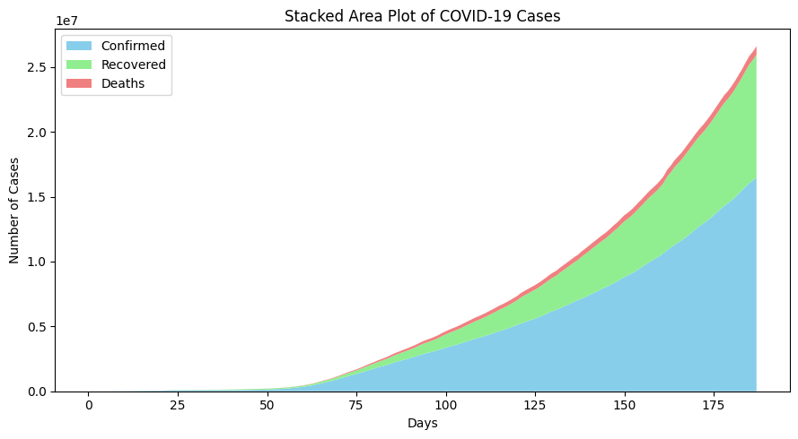
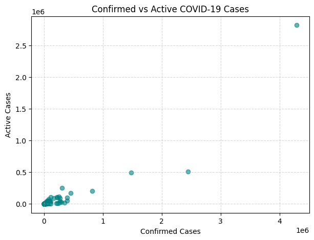
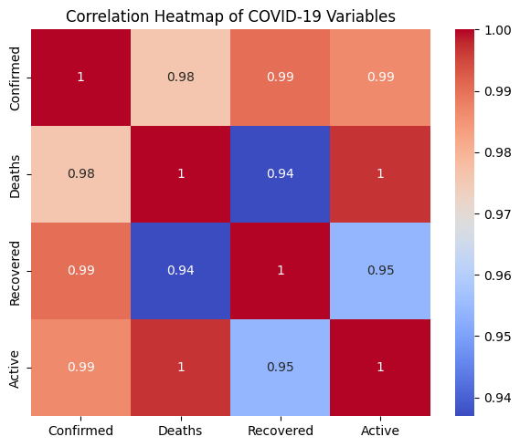
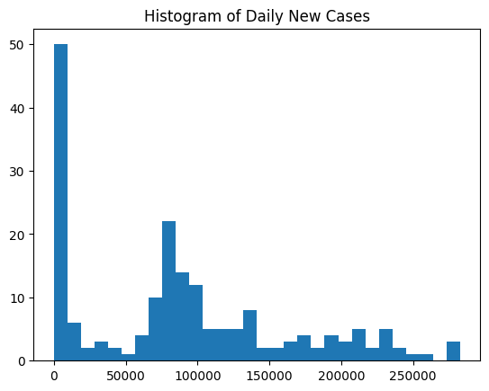
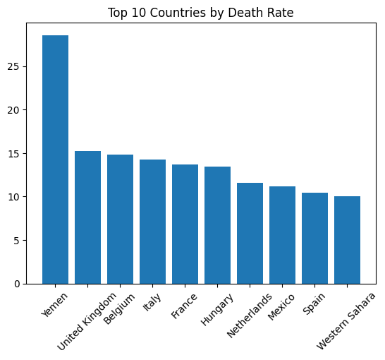

# 🦠 COVID-19 Data Analysis Project

## 📘 Introduction
The **COVID-19 Data Analysis Project** is a Python-based data analytics project that explores global and country-wise COVID-19 trends using real-world datasets.  
The project applies **numerical analysis**, **data aggregation**, and **data visualization techniques** to understand the spread, impact, and relationships between COVID-19 variables such as confirmed cases, deaths, recoveries, and active cases.

This project is designed for **academic submission**, **portfolio use**, and **practical learning** of data analytics concepts.

---

## 🎯 Project Objectives
- To analyze COVID-19 data using Python libraries
- To perform numerical analysis using NumPy
- To explore datasets using Pandas
- To visualize trends, distributions, and correlations
- To gain hands-on experience with real-world datasets
- To present insights through meaningful charts and graphs

---

## 🛠️ Tools & Technologies
- **Python 3**
- **NumPy** – numerical computations
- **Pandas** – data manipulation and analysis
- **Matplotlib** – data visualization
- **Seaborn** – advanced visualizations (heatmaps)
- **Jupyter Notebook / Python Script**

---

## 📂 Dataset Description

### 1️⃣ `day_wise.csv`
Contains **daily global COVID-19 data**.
- Confirmed cases
- Deaths
- Recovered cases
- New cases
- Active cases
- Date-wise records

### 2️⃣ `country_wise_latest.csv`
Contains **latest country-wise COVID-19 statistics**.
- Country/Region
- Confirmed
- Deaths
- Recovered
- Active cases

### 3️⃣ `covid_19_clean_complete.csv`
A **cleaned and combined dataset** used for:
- Country-wise grouping
- Maximum case calculations
- Comparative analysis

---

## 🔍 Methodology

1. **Data Loading**
   - CSV files are loaded using Pandas
2. **Data Inspection**
   - Shape, columns, and missing values are checked
3. **Numerical Analysis**
   - Max, mean, and standard deviation calculated using NumPy
4. **Data Aggregation**
   - Country-wise grouping using `groupby()`
5. **Visualization**
   - Multiple plots created using Matplotlib and Seaborn

---

## 📊 Visualizations & Interpretation

### 🥧 1. Global COVID-19 Case Distribution (Pie Chart)
Shows the **percentage share** of:
- Confirmed cases
- Deaths
- Recovered cases

📌 *Interpretation:*  
Recovered cases form the largest portion, while deaths represent a smaller percentage.

---

### 📊 2. Top 10 Countries by Confirmed Cases (Horizontal Bar Chart)
Displays the **top 10 countries** with the highest confirmed cases.

📌 *Interpretation:*  
A small number of countries account for a large share of global cases.

---

### 📈 3. Overall COVID-19 Case Trends (Line Plot)
Compares trends of:
- Confirmed
- Deaths
- Recovered cases

📌 *Interpretation:*  
Confirmed and recovered cases increase steadily, while deaths grow at a slower rate.

---

### 📦 4. Distribution of COVID-19 Cases (Box Plot)
Shows:
- Median
- Spread
- Outliers

📌 *Interpretation:*  
Confirmed cases have higher variation compared to deaths and recoveries.

---

### 🌊 5. Growth Pattern of COVID-19 Cases (Stacked Area Plot)
Visualizes cumulative growth over time.

📌 *Interpretation:*  
Shows how recoveries and deaths contribute to total cases.

---

### 🔵 6. Confirmed vs Active Cases (Scatter Plot)
Shows the **relationship** between confirmed and active cases.

📌 *Interpretation:*  
Higher confirmed cases generally result in higher active cases.

---

### 🔥 7. Correlation Heatmap
Displays correlation between:
- Confirmed
- Deaths
- Recovered
- Active cases

📌 *Interpretation:*  
Strong positive correlation exists between confirmed and recovered cases.

---

### 📉 8. Daily New COVID-19 Cases (Histogram)
Shows the **frequency distribution** of new cases.

📌 *Interpretation:*  
Most days fall within a specific range of new cases.

---

### ⚠️ 9. Top 10 Countries by Death Rate (Bar Chart)
Displays countries with the **highest death rate percentages**.

📌 *Interpretation:*  
Death rate depends on healthcare systems and testing strategies.

---

## 🧮 Numerical Analysis Summary
- **Maximum Confirmed Cases**
- **Mean Deaths**
- **Standard Deviation of Confirmed Cases**

These statistics help in understanding data spread and central tendency.

---

## 🧑‍💻 Project Structure

